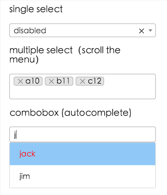

# upload.react

> React,Upload.Custom style!

[](https://travis-ci.org/fast-flow/upload.react)
[](https://npmjs.org/package/upload.react)
[](https://npmjs.org/package/upload.react)


## Install

```shell
npm install upload.react --save
```

## Example

[](http://fast-flow.github.io/upload.react/example)

## Online documentation

[Online](http://fast-flow.github.io/upload.react)

## Change log

[CHANGELOG](./CHANGELOG.md)
